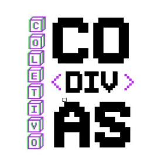

                                                                                                                                                                                                                                                                                                                                                                                                                                                                                            
# **WELCOME, I'M MÁRCIA SIMPLÍCIO - AWS DEVELOPER ASSOCIATE**

 

## * [About Me](https://placehold.it/15/#000080/000000?text=+)

Meu nome é Márcia Simplício, sou brasileira, moro no Estado do Rio de Janeiro, onde nasci e cresci.

No meu tempo livre adoro ler sobre tudo e escrever meus romances.

Me apaixonei por tecnologia no ano de 1995, quando tive contato com um desktop pela primeira vez e, desde então, nunca mais parei de mexer. 

A tecnologia significa o mundo para mim, assim como a escrita, que é uma outra paicão, sem os quais não vivo.

Sou uma Desenvolvedora Front-end com experiência em Html5, Css3, React.js, TypeScript, Javascript e Node.js.

Atualmente trabalho como audiencista no Fórum Regional do Méier, da minha cidade.

Desejo me tornar uma desenvolvedora especialista em Back-end dentro da Nuvem da Amazon Web Services (AWS).

No meu tempo livre, curto uma boa leitura, filmes e séries de suspenses, terror e drama.

 

Atualmente faço o curso da   *ESCOLA DA NUVEM*  para me especializar em Cloud AWS, onde tem toda a preparação para o exame de certificação Cloud Pratitioner.

Procuro colaborar em  **projetos open source ligados ao back-end para pegar mais experiência**

  

🤔 Estou procurando ajuda com  **mentorias de back-end**

  

💬 Pergunte-me sobre  **programação**

  

👩🏽‍🦱Pronomes: ela/dela

  

  ## * [Habilidades](https://placehold.it/15/#000080/000000?text=+)
 
  
   
   
   
   
   
     

  

           
 ## * [Estudando](https://placehold.it/15/#000080/000000?text=+)
  
  
   
   

 LINUX CLOUD AWS

 

 ## * [Pretendo Estudar](https://placehold.it/15/#000080/000000?text=+)
 
  
   
   
   

 

 ## * [Ferramentas e IDEs](https://placehold.it/15/#000080/000000?text=+)

   
   
   
   
   
   
   
   
   
   
   

 

  
 ## * [Where To Find Me](https://placehold.it/15/#000080/000000?text=+)
 

 
  
    
 
 

 

 ## * [Freelas](https://placehold.it/15/#000080/000000?text=+) 
 
 
  
     
  

  
 
 ---
 
  

 
---

 

  

 
  

